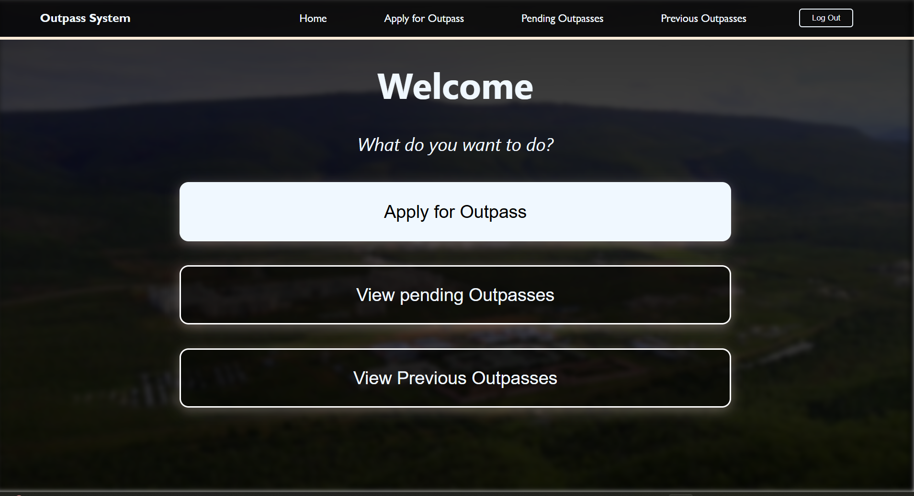

# Digital outpass system

Digital Outpass System is a web portal designed to facilitate the generation of outpasses for students residing in hostels, reducing paperwork and improving efficiency. The system is built using the MERN (MongoDB, Express.js, React.js, Node.js) stack, providing a robust and scalable solution.

# Screenshots

